# ═══════════════════════════════════════════════════════════════
#   WEALTHIFY — Mutual Fund Transaction Dashboard
# ═══════════════════════════════════════════════════════════════

Wealthify is a sleek, modern, and production-ready full-stack application designed to aggregate, analyze, and visualize mutual fund transactions. It provides interactive, glassmorphic analytics, tree/accordion summary tables, and full CRUD operations on investors, funds, and transactions.

The application runs in both **Live Backend Mode** (connecting to a FastAPI/PostgreSQL server) and **Offline Demo Mode** (persisted locally using standard web `localStorage`), with a seamless failover capability.

---

## 🛠️ System Dependencies & Tools Needed

To set up and run this application locally, you will need the following tools installed on your system:

1. **Python 3.10+**: Make sure Python is installed and added to your system's PATH.
2. **PostgreSQL Database Server**: Required for live backend database storage.
3. **pgAdmin** or any SQL Client (Optional): Helpful for inspecting the database tables manually.
4. **Web Browser**: Google Chrome, Mozilla Firefox, Microsoft Edge, or Safari to run the frontend interface.
5. **Git** (Optional): For version control.

---

## ⚙️ How to Setup

### 1. Database Configuration
1. Open your PostgreSQL SQL shell or client and create a new, empty database named `wealthify`:
   ```sql
   CREATE DATABASE wealthify;
   ```
2. Navigate to the `backend/` directory:
   ```bash
   cd backend
   ```
3. Create a `.env` file (or update the existing one) with your database credentials:
   ```env
   DATABASE_URL=postgresql://<postgresql_username>:<postgresql_password>@localhost:5432/wealthify
   DATA_FILE_PATH=app/data/dataset.csv
   ```
   *(Replace `<postgresql_username>` and `<postgresql_password>` with your actual PostgreSQL local credentials).*

### 2. Python Virtual Environment Setup
1. In the `backend/` directory, create a Python virtual environment:
   ```bash
   python -m venv venv
   ```
2. Activate the virtual environment:
   * **Windows (Command Prompt / PowerShell)**:
     ```bash
     .\venv\Scripts\activate
     ```
   * **macOS / Linux**:
     ```bash
     source venv/bin/activate
     ```
3. Install all the required backend dependencies:
   ```bash
   pip install -r requirements.txt
   ```

---

## 🚀 How to Run the Code

### 1. Seed the Database
Before running the backend for the first time, you must seed the database with baseline transaction data from the CSV file (`app/data/dataset.csv`):
```bash
python seed_db.py
```
This script will automatically create the required database tables (Investors, Funds, and Transactions) and seed them with the standard dataset.

### 2. Start the Backend API Server
Start the FastAPI server using `uvicorn`:
```bash
uvicorn app.main:app --reload
```
The console will output:
`INFO:     Uvicorn server running on http://127.0.0.1:8000 (Press CTRL+C to quit)`

---

## 💻 How to See the Output Details

Once the server is running, you can explore the application in two ways:

### 1. Through the Live Frontend Application
Open your web browser and navigate to:
👉 **[http://127.0.0.1:8000/](http://127.0.0.1:8000/)**

The FastAPI backend serves the frontend statically. In this mode, the app connects directly to the PostgreSQL database on your local machine, allowing you to add, edit, or delete transactions and view real-time calculations.

### 2. Through the Swagger API Documentation
FastAPI automatically generates interactive REST API documentation. To inspect the endpoints, query formats, and schemas, visit:
👉 **[http://127.0.0.1:8000/docs](http://127.0.0.1:8000/docs)**

### 3. Through Offline / Demo Mode (Fallback)
If the backend is not running, or if you open the `index.html` file directly from your disk (e.g., via `file://` protocol or GitHub Pages hosting), the app will run in **Offline Demo Mode**. It will load a mock database containing the baseline CSV dataset directly inside your browser's `localStorage`. You can still perform full CRUD operations, and all changes will persist across browser refreshes!

---

## 📋 Dashboard Views & CRUD Workflow

The application separates concerns by distinguishing between **Read-Only Aggregated Reports** and **Actionable CRUD Registries**:

### 1. Read-Only Analytical Views (No Direct CRUD)
* **Dashboard Overview**: Displays real-time KPIs (Total Invested, Total Units, Avg NAV, Active Funds) and interactive charts.
* **Investor Summary**: Shows clients with nested tree/accordion tables detailing fund-wise aggregates.
* **Fund-wise Summary**: Shows mutual funds with nested client breakdown details.

> [!NOTE]
> These summaries are calculated dynamically. Any CRUD actions performed on transactions, investors, or funds will automatically and instantly update these reports.

### 2. Actionable Registries (Full CRUD Enabled)
* **All Investors Tab**: Add new investors, edit details (name/PAN), or delete investors.
* **All Funds Tab**: Register new mutual fund schemes, edit names/AMC/types, or delete schemes.
* **Transactions Tab**: Log new purchase transactions, edit amount/units/NAV/dates, or delete transaction records.

---

## 📊 Application Output Screens

Below are screenshots of the key screens and views in Wealthify:

### 1. Dashboard Overview (Top Analytics)
Displays aggregated mutual fund metrics, capital weights, and allocations:
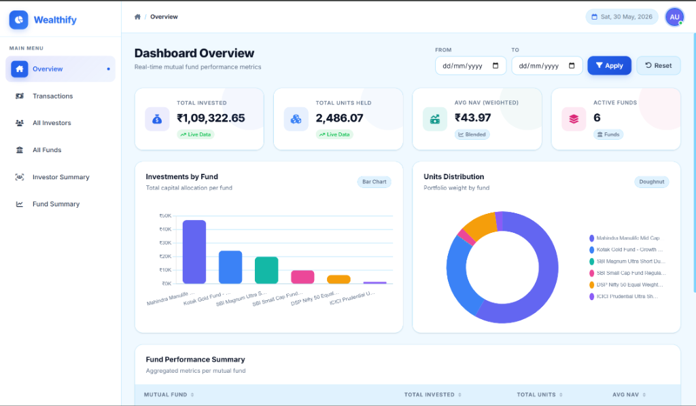

### 2. Dashboard Overview (Performance Summary)
Displays aggregated metrics per mutual fund scheme:
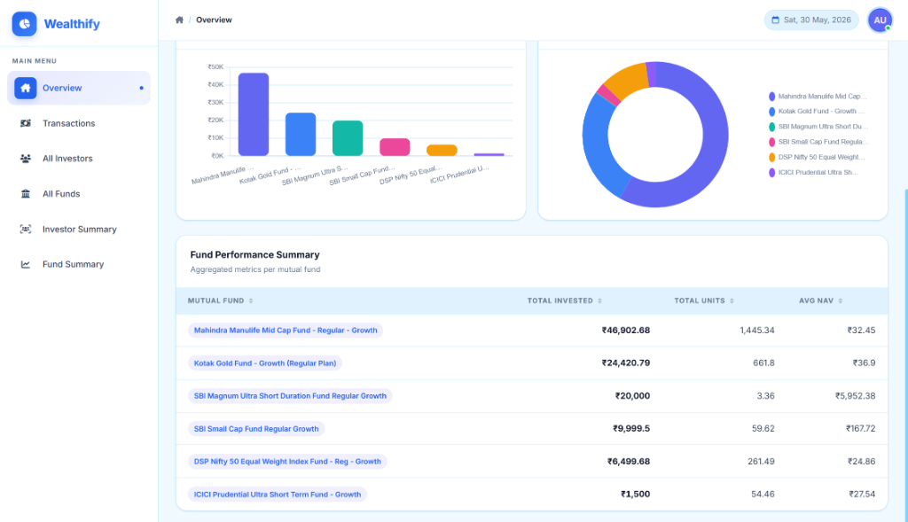

### 3. Transactions Ledger
Searchable, paginated registry of mutual fund transactions:
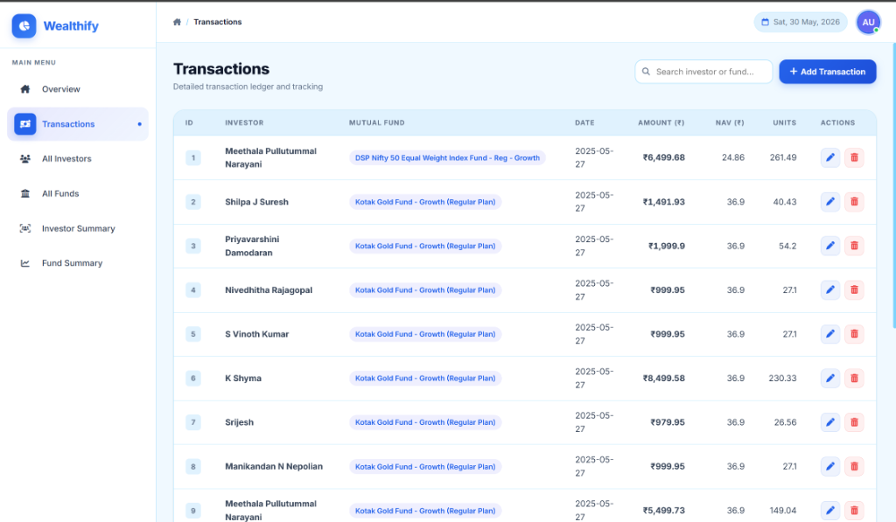

### 4. Transaction CRUD Management Form
Glassmorphic modal dialog form for adding or editing transaction records:
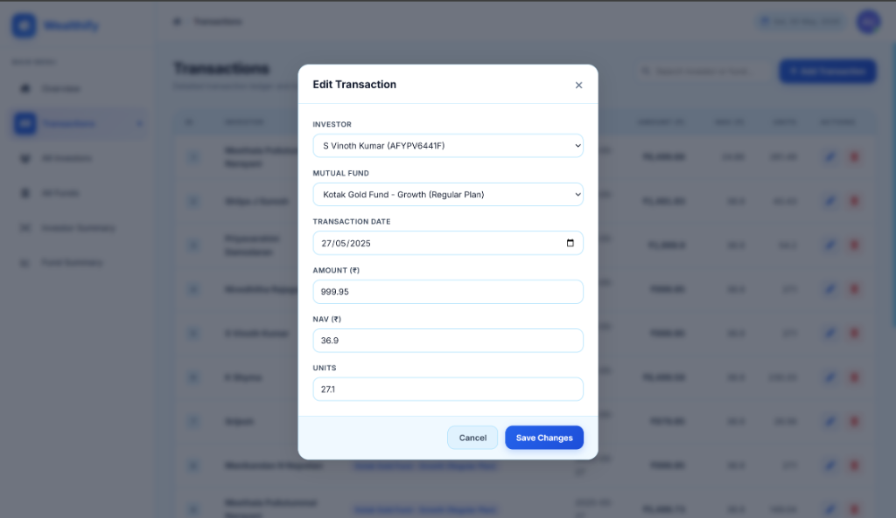

### 5. All Investors Registry
Registry of investors with total net-worth aggregates:
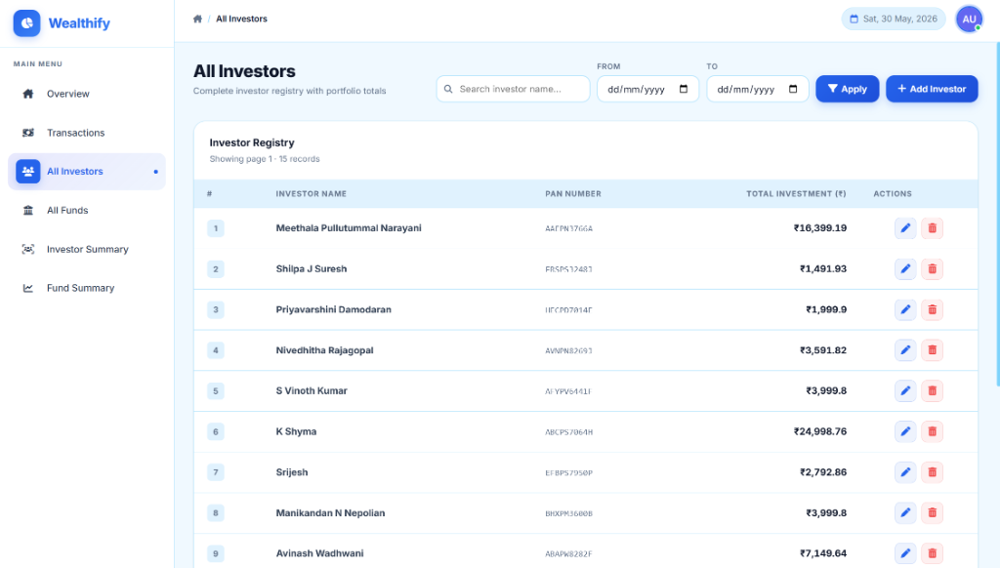

### 6. Edit Investor Form
Modal dialog to edit an existing investor's name and PAN number:
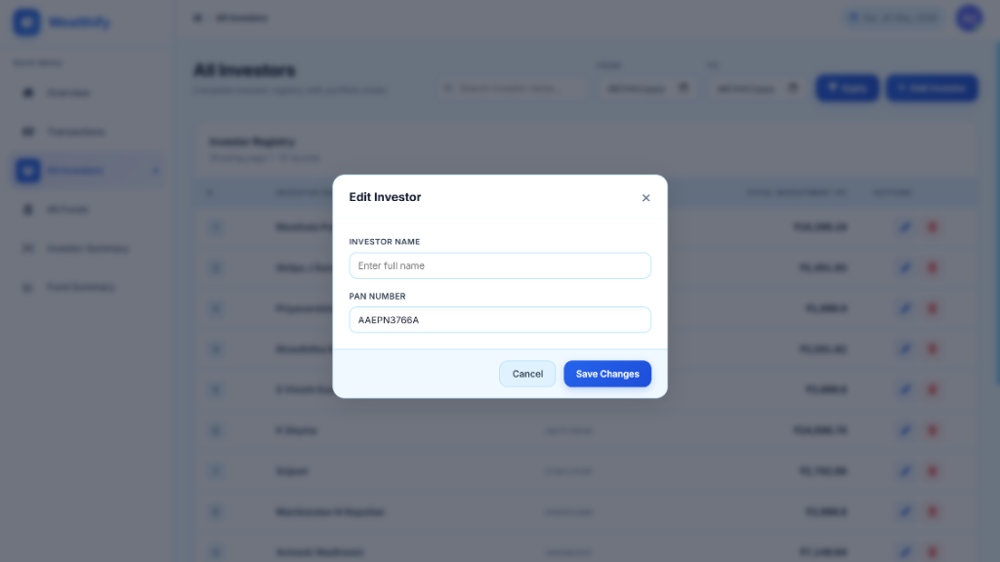

### 7. Add Investor Form
Modal dialog to register a brand new investor:
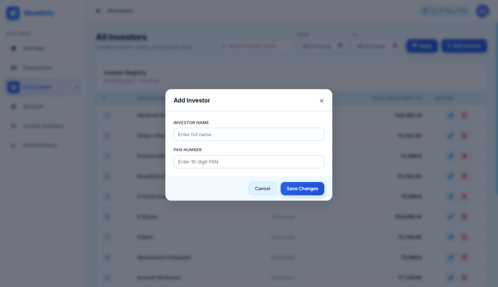

### 8. All Funds Directory
Complete list of all registered mutual fund schemes with AMC code and scheme type:
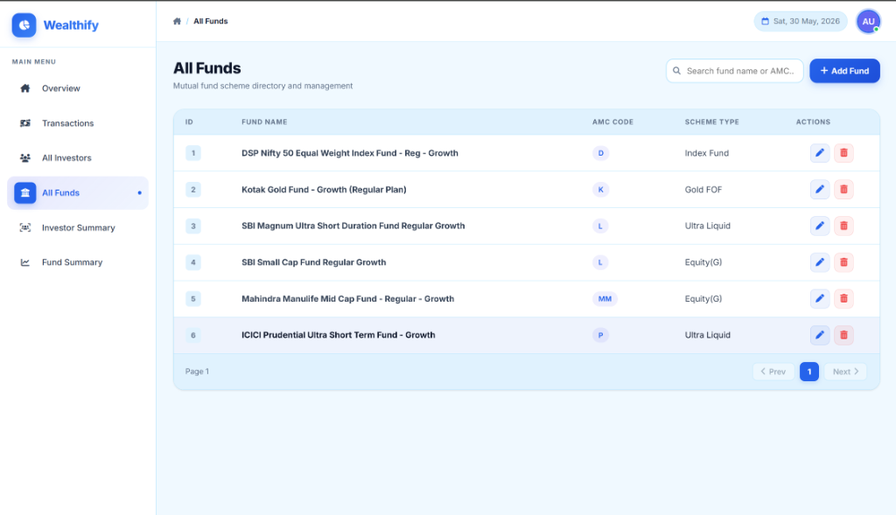

### 9. Edit Fund Form
Modal dialog to edit an existing fund's name, AMC code, and scheme type:
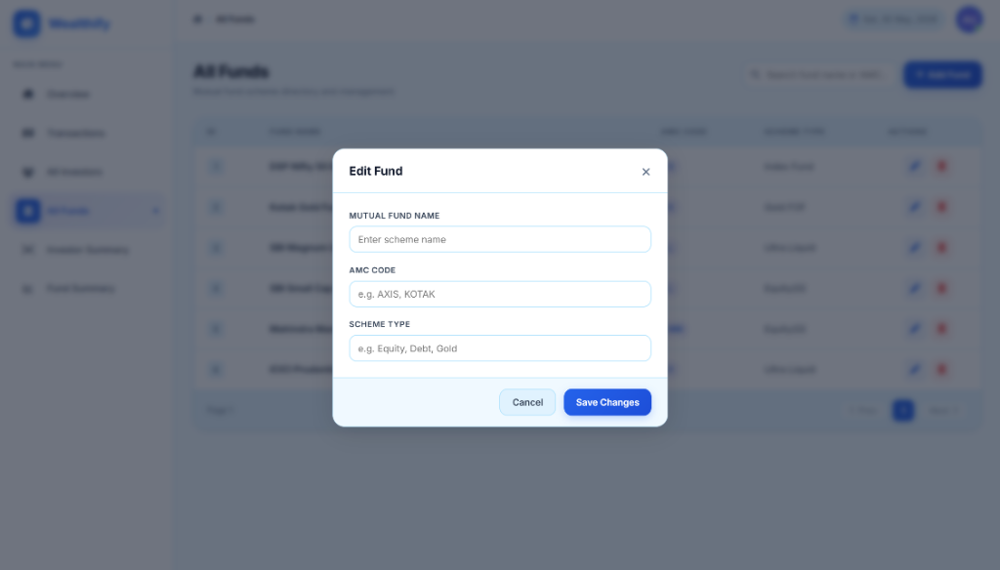

### 10. Add Fund Form
Modal dialog to register a new mutual fund scheme:


### 11. Investor Summary (Accordion View)
Collapsible tree view showing each investor's total investment with nested fund breakdown:
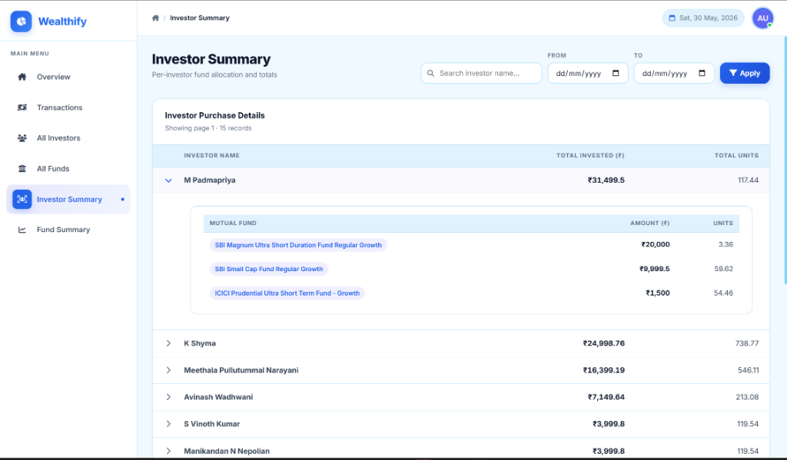

### 12. Fund-wise Summary (Accordion View)
Collapsible tree view showing each mutual fund with nested investor contribution breakdown:
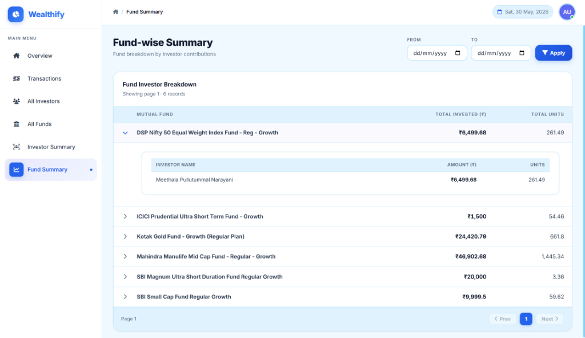

### 13. Swagger API Documentation
FastAPI automatic interactive OpenAPI route and schema documentation:
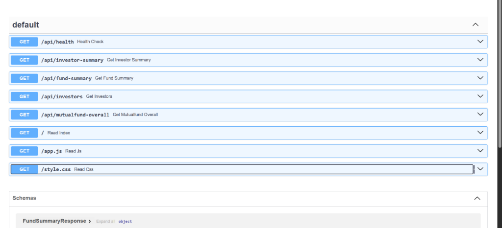
